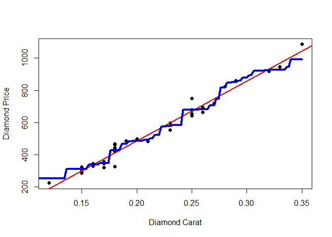

About the Course Project
------------------------

Create a Shiny application and deploy it on Rstudio's servers. Second, Use Slidify or Rstudio Presenter to prepare a reproducible pitch presentation about application.

Instructions: The application must include the following:

1.  Some form of input (widget: textbox, radio button, checkbox, ...)
2.  Some operation on the ui input in sever.R
3.  Some reactive output displayed as a result of server calculations
4.  You must also include enough documentation so that a novice user could use your application.
5.  The documentation should be at the Shiny website itself. Do not post to an external link.

How to use the application
--------------------------

This application predicts the price of a diamond given the carat value for the diamond. Two model used for the price predication.

-   First model: Linear Regression
-   second model: Random Forest

If user selected Carat value in the slidebar. The two model predict value show in the plot and label.

The application is running on(<https://nskit84.shinyapps.io/Predict_Diamond_Price/>)

Ui.R ans Server.R code in my github repository (<https://github.com/nskit84/ShinyApp>)

Diamond Dataset
---------------

The data used in the app comes from the diamond dataset in UsingR package.

``` r
library(UsingR)
library(caret)
```

``` r
summary(diamond)
```

    ##      carat            price       
    ##  Min.   :0.1200   Min.   : 223.0  
    ##  1st Qu.:0.1600   1st Qu.: 337.5  
    ##  Median :0.1800   Median : 428.5  
    ##  Mean   :0.2042   Mean   : 500.1  
    ##  3rd Qu.:0.2500   3rd Qu.: 657.0  
    ##  Max.   :0.3500   Max.   :1086.0

Plot
----

In the scatterplot below are reprensented the data used for the prediction model 
